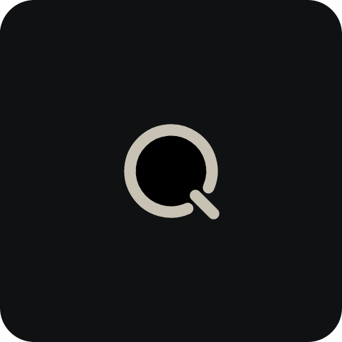
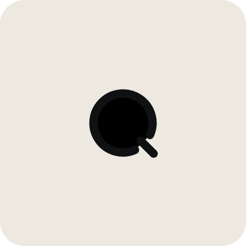
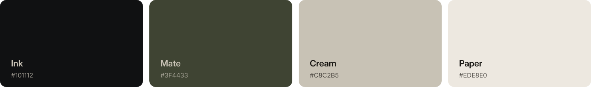

  

  <a href="https://querenciasoftware.com.br">Site</a>
  &nbsp;&nbsp;·&nbsp;&nbsp;
  <a href="https://querenciasoftware.com.br/portfolio">Portfólio</a>
  &nbsp;&nbsp;·&nbsp;&nbsp;
  <a href="https://querenciasoftware.com.br/design-system">Design system</a>
  &nbsp;&nbsp;·&nbsp;&nbsp;
  <a href="https://querenciasoftware.com.br/sistema">Marca</a>
  &nbsp;&nbsp;·&nbsp;&nbsp;
  <a href="https://neohabit.com.br">NeoHabit</a>

Produto próprio, sistemas sob medida e um design system white-label. Quem programa é quem conversa com você.

## O que a gente faz

**Produto digital.** Web e mobile desenhados para quem usa de verdade, não para o organograma. Portal, painel, o sistema que vira rotina.

**Sistemas e ligações.** O que a empresa já tem conversa com o que entra. Painel interno, automação, API, planilha que vira operação.

**No ar e cuidado.** Hospedagem, monitoramento e evolução. O sistema não some no dia da entrega.

White-label de verdade: a cor da marca muda botões, campo, ícones e tabela. O restante entra no produto. O playground está em [querenciasoftware.com.br/design-system](https://querenciasoftware.com.br/design-system).

## No ar

**[NeoHabit](https://neohabit.com.br)** é gestão condominial para administradoras. Painel da empresa, ciclo de cobrança, caixas e auditoria. É o produto público. Sistema de cliente fica com o cliente, e entra com a marca dele.

## Como trabalhamos

1. **Conversa.** O problema, o que já existe, o que precisa mudar.
2. **Escopo e prazo.** O que entra, quando e por quanto. Você aprova antes de começar.
3. **Construção.** Entregas parciais em ambiente de teste. Você usa e corrige a rota.
4. **No ar.** Produção, acompanhamento e evolução conforme a operação pede.

Assinatura ou compra. Dá para começar na assinatura e migrar depois, com crédito do investido. O código fica com você nos dois modelos.

## A marca

Cuia + bomba = Q.

  
  &nbsp;&nbsp;
  

O círculo é a cuia vista de cima. A diagonal é a bomba. Juntos formam o Q de Querência: o lugar para onde se volta.

- **Círculo.** Cuia vista de cima.
- **Diagonal.** Bomba. Liga o que está dentro ao que sai.
- **Querência.** O lugar para onde se volta.

Vetor do símbolo: [`assets/mark.svg`](assets/mark.svg) no escuro, [`assets/mark-on-light.svg`](assets/mark-on-light.svg) no claro.

## Identidade visual

  

Quatro bases: Ink, Mate, Cream e Paper. No produto, a escala da marca acompanha a interface.

**Instrument Serif** para ênfase. **Inter** para interface, wordmark e corpo. O wordmark vai em caixa alta, com tracking aberto.

A marca completa, com lockups e ícones, está em [querenciasoftware.com.br/sistema](https://querenciasoftware.com.br/sistema).

## Contato

[WhatsApp 54 9637-2268](https://wa.me/5554996372268) · [contato@querenciasoftware.com.br](mailto:contato@querenciasoftware.com.br) · [@querencia.software](https://instagram.com/querencia.software)

Este repositório é o perfil público da organização.
